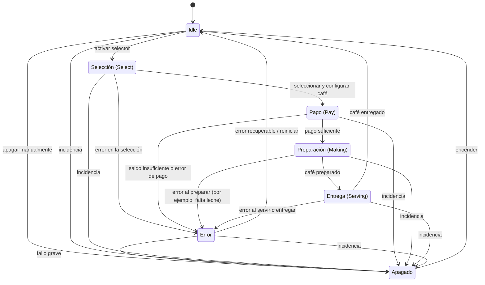

# Estados de la máquina de café

Este documento describe los estados y las transiciones de la máquina de café.

## Estados

| Estado | Descripción |
|---|---|
| **Idle** | Estado inicial y de espera. Desde aquí se puede iniciar la selección de un café mediante la opción `selector` o apagar la máquina. |
| **Select** | Permite elegir el tipo de café (por ejemplo, normal o americano) y configurar el tamaño, la leche y el azúcar. Cuando la selección está completa, continúa al pago. |
| **Pay** | Comprueba si el usuario dispone de saldo suficiente y solicita confirmar el pago. Si se confirma y el saldo es suficiente, comienza la preparación. |
| **Making** | Prepara el café y realiza las acciones necesarias, como servir el café y añadir leche. Al terminar, pasa a la entrega. |
| **Serving** | Indica que el café está listo y se lo entrega al usuario. Una vez entregado, la máquina vuelve a **Idle**. |
| **Error** | Informa de un problema ocurrido durante el proceso. Tras gestionar el error, la máquina vuelve a **Idle** o pasa a **Off**, según la gravedad. |
| **Off** | Máquina apagada: no realiza ninguna acción hasta que se vuelva a encender. Al encenderla, pasa a **Idle**. |

Transiciones

- `Idle` → `Selección`: el usuario activa `selector`.
- `Idle` → `Apagado`: el usuario apaga la máquina.
- `Selección` → `Pago`: se han elegido el café y sus configuraciones.
- `Pago` → `Preparación`: el pago es suficiente.
- `Preparación` → `Entrega`: el café se ha preparado correctamente.
- `Entrega` → `Idle`: el café se ha entregado.
- Desde `Selección`, `Pago`, `Preparación` o `Entrega` → `Error`: ocurre un problema durante esa etapa.
- `Error` → `Idle`: el error es recuperable y se reinicia el proceso.
- `Error` → `Apagado`: el fallo es grave.
- Desde cualquier estado operativo (`Idle`, `Selección`, `Pago`, `Preparación`, `Entrega` o `Error`) → `Apagado`: ocurre una incidencia que obliga a detener la máquina.
- `Apagado` → `Idle`: el usuario vuelve a encender la máquina.

## Flujo habitual
Diagrama de estados

1. La máquina espera en **Idle**. Al seleccionar `selector`, comienza el proceso.
2. En **Select**, el usuario elige el café y sus opciones: tamaño, con o sin leche y con o sin azúcar.
3. En **Pay**, se comprueba el saldo. Con saldo suficiente y pago confirmado, se pasa a **Making**.
4. **Making** prepara el café. Cuando está listo, se pasa a **Serving**.
5. **Serving** entrega el café y, cuando el usuario ya lo ha recibido, la máquina vuelve a **Idle**.

## Errores y apagado

Durante **Select**, **Pay**, **Making** o **Serving** puede producirse un error. Algunos ejemplos son saldo insuficiente, falta de leche o un problema al servir el café. En ese caso, se pasa a **Error**, donde se informa del problema. Después, se vuelve a **Idle** si la máquina puede continuar funcionando, o a **Off** si el problema requiere apagarla.

La máquina también puede pasar a **Off** desde cualquiera de los estados si ocurre una avería o una situación que obligue a detenerla. Mientras esté apagada no procesa operaciones; al encenderse, vuelve a **Idle**.